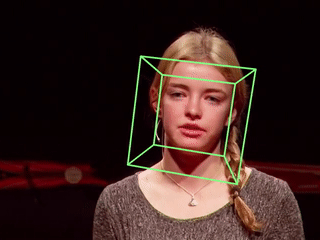

# Head pose estimation

Realtime human head pose estimation with ONNX Runtime and OpenCV.




## How it works

There are three major steps:

1. Face detection. A face detector is introduced to provide a face bounding box containing a human face. Then the face box is expanded and transformed to a square to suit the needs of later steps.
2. Facial landmark detection. A pre-trained deep learning model take the face image as input and output 68 facial landmarks.
3. Pose estimation. After getting 68 facial landmarks, the pose could be calculated by a mutual PnP algorithm.

## Getting Started

These instructions will get you a copy of the project up and running on your local machine for development and testing purposes.

### Prerequisites

The code was tested on Ubuntu 22.04 with following frameworks:
- ONNX Runtime: 1.17.1
- OpenCV: 4.5.4

### Installing

Clone the repo:
```bash
git clone https://github.com/yinguobing/head-pose-estimation.git
```

Install dependencies with pip:
```bash
pip install -r requirements.txt
```

Pre-trained models provided in the `assets` directory. Download them with Git LFS:
```bash
git lfs pull
```

Or, download manually from the [release page](https://github.com/yinguobing/head-pose-estimation/releases).

## Running

A video file or a webcam index should be assigned through arguments. If no source provided, the built in webcam will be used by default.

### Video file

For any video format that OpenCV supports (`mp4`, `avi` etc.):

```bash
python3 main.py --video /path/to/video.mp4
```

### Webcam

The webcam index should be provided:

```bash
python3 main.py --cam 0
``` 

## Retrain the model

Tutorials: https://yinguobing.com/deeplearning/

Training code: https://github.com/yinguobing/cnn-facial-landmark

Note: PyTorch version coming soon!

## License
This project is licensed under the MIT License - see the [LICENSE](LICENSE) file for details. 

Meanwhile: 

- The face detector is [SCRFD](https://github.com/deepinsight/insightface/tree/master/detection/scrfd) from InsightFace. 
- The pre-trained model file was trained with various public datasets which have their own licenses. 

Please refer to them for details.

## Authors
Yin Guobing (尹国冰) - [yinguobing](https://yinguobing.com)


## Acknowledgments

All datasets used in the training process:
- 300-W: https://ibug.doc.ic.ac.uk/resources/300-W/
- 300-VW: https://ibug.doc.ic.ac.uk/resources/300-VW/
- LFPW: https://neerajkumar.org/databases/lfpw/
- HELEN: http://www.ifp.illinois.edu/~vuongle2/helen/
- AFW: https://www.ics.uci.edu/~xzhu/face/
- IBUG: https://ibug.doc.ic.ac.uk/resources/facial-point-annotations/

The 3D face model is from OpenFace, you can find the original file [here](https://github.com/TadasBaltrusaitis/OpenFace/blob/master/lib/local/LandmarkDetector/model/pdms/In-the-wild_aligned_PDM_68.txt).

The build in face detector is [SCRFD](https://github.com/deepinsight/insightface/tree/master/detection/scrfd) from InsightFace. 
